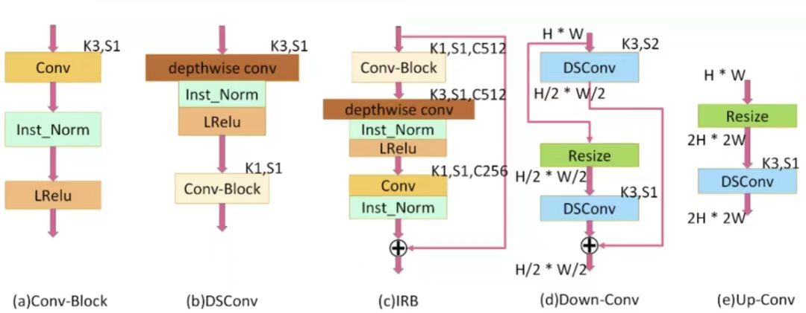
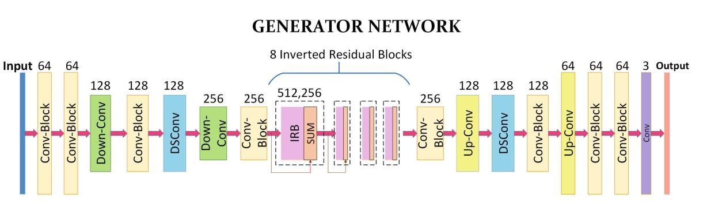
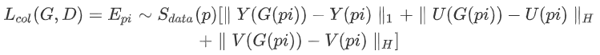
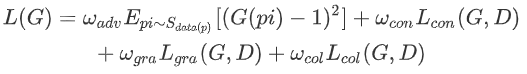
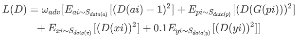
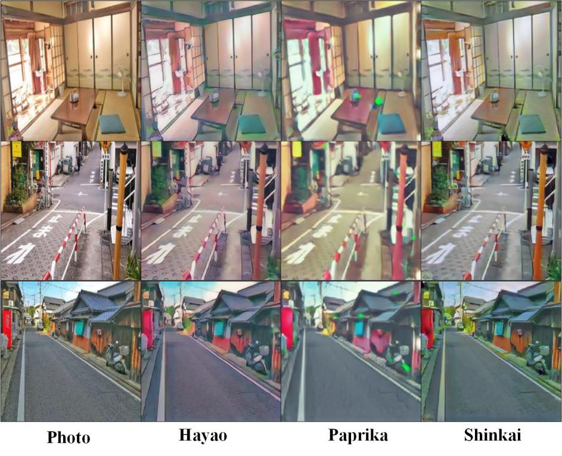

# AnimeGANv2


### This is a rewrite by our group for the 2022 Computer Vision Final Assignment of the School of Intelligent Engineering of Sun Yat-sen University。Mindspore's version of AnimeGAN2

### writer---zhangyuying tangshen qumu, enlong huangjing tianyun


复现了AnimeGAN2的mindspore版本。

### 原理解释

AnimeGANv2是一种采用神经风格转换+生成对抗网络(GANs)，将真实场景转换为动画风格的轻量级生成对抗网络，是基于CartoonGAN的改进。

#### 模型介绍

​		AnimeGANv2模型由两个卷积神经网络构成：生成器generator G，用于生成动画图片；判别器discriminator D用于判别输入的图片是real或fake。

​		AnimeGANv2是在AnimeGAN的基础上将实例归一化(instance normalization)改为使用特征的层归一化(layer normalization)从而解决AnimeGAN中存在的高频伪影问题。

​		首先介绍AnimeGAN模型，其生成器与判别器网络如图1所示。生成器方框上的数字代表channel数，SUM表示element-wise sum，K代表卷积核大小， C是feature map数，S是stride，Inst_Norm表示instance normalization（实例归一化）。


<center style="text-decoration:underline">图1.AnimeGAN生成器和判别器网络结构</center>

​		每个block结果如图2所示。	



<center style="text-decoration:underline">图2.AnimeGAN网络block结构图</center>

​		AnimeGANv2使用与AnimeGAN相同的判别器，只是将实例归一化改为特征的层归一化；同时改进了生成器网络参数，使其更加轻量化，其结构如图3表示，其中K表示卷积核的大小，S表示步长，C表示卷积核的个数，IRB表示反向残差块，resize表示插值上采样方法，SUM表示逐元素相加。

<center style="text-decoration:underline">图3.AnimeGANv2生成器网络结构</center>

#### 损失函数

##### 生成器损失

​		生成器损失函数主要分为四个部分，不同的损失有不同的权重系数，作者所采用的是 300、1.5、3、10：


​		其中损失函数各个部分：

1. 对抗损失（adv），生成器 G 中影响动画转换过程的对抗性损失。

2. 内容损失（con），帮助生成的图像保留输入照片内容的内容丢失。

3. 灰度风格损失（gra），使生成的图像在纹理和线条上具有清晰的动漫风格。

4. 颜色重建损失（col），使生成的图像具有原照片的颜色。

​        内容丢失和灰度风格丢失，使用预先训练好的VGG19作为感知网络，提取图像的高级语义特征,损失表示为：


​		关于颜色的提取与转换，原文作者首先将 RGB 通道转换为 YUV 通道，然后对不同通道使用不同的损失计算方法：



​		最终生成器损失函数表示为：



##### 判别器损失

​		AnimeGAN模型判别器损失在引入 CartoonGAN提出的促进边缘对抗损失(为了生成清晰的卡通图像边缘)外，采用一种灰度对抗损失防止生成灰度图像，最终判别器损失如下：



## Pretrained model

### AnimeGANv2 Model trained by MindSpore

```text
check_points  
└──check_points
       ├──animeganv2_generator_Hayao.ckpt
       ├──animeganv2_generator_Paprika.ckpt
       ├──animeganv2_generator_Shinkai.ckpt
```


### Vgg19 model


预训练的[vgg19]（https://download.mindspore.cn/vision/animeganv2/vgg.ckpt) 模型用于特征提取和损失函数计算。请将此文件放在与此文件相同的目录中。 

## Training Parameter description

| Parameter            | Default        | Description                                    |
| :------------------- | :------------- | :--------------------------------------------- |
| device_target        | GPU            | Device type                                    |
| device_id            | 0              | Device ID                                      |
| dataset              | Hayao          | Dataset name                                   |
| data_dir             | ../dataset     | Path of training dataset                       |
| checkpoint_dir       | ../checkpoints | Path to save checkpoint                        |
| vgg19_path           | ../vgg.ckpt    | Path of vgg19                                  |
| save_image_dir       | ../images      | Path to save images                            |
| resume               | False          | Whether to load pretrained model               |
| phase                | train          | Setup phase                                    |
| epochs               | 40             | The number of epochs to run                    |
| init_epochs          | 5              | The number of epochs for weight initialization |
| batch_size           | 4              | The size of batch size                         |
| num_parallel_workers | 1              | Number of parallel workers                     |
| save_interval        | 1              | Save the model during training                 |
| debug_samples        | 0              | Dataset name                                   |
| lr_g                 | 2.0e-4         | Generator learning rate                        |
| lr_d                 | 4.0e-4         | Discriminator learning rate                    |
| init_lr              | 1.0e-3         | Initial learning rate                          |
| gan_loss             | lsgan          | Network loss type                              |
| wadvg                | 1.2            | Adversarial loss weight for Generator          |
| wadvd                | 300            | Adversarial loss weight for Discriminator      |
| wcon                 | 1.8            | Content loss weight                            |
| wgra                 | 2.0            | Gram loss weight                               |
| wcol                 | 10.0           | Color loss weight                              |
| img_ch               | 3              | The size of image channel                      |
| ch                   | 64             | Base channel number per layer                  |
| n_dis                | 3              | The number of discriminator layer              |

## The overall structure of the project

```text
└──animeganv2
    ├──readme.md
    ├──animeganv2.ipynb
    ├──vgg.ckpt
    ├──src
        ├──animeganv2_utils
            ├──adjust_brightness.py             # 调整输出图像的亮度.
            ├──edge_smooth.py                   # 平滑动画图像并将其保存在新目录中.
            └──pre_process.py                   # 常用图像处理功能和工具功能.
        ├──losses
            ├──color_loss.py                    # 损失函数.
            ├──gram_loss.py                     # 损失函数.
            ├──loss.py                          # 生成和辨别损失.
            ├──utils.py                         # 图像处理工具.
            └──vgg19.py                         # vgg19 网络.
        ├──models
            ├──animegan.py                      # 动漫网络的连接器，损失和优化器.
            ├──con2d_block.py                   # 卷积模块.
            ├──discriminator.py                 # D网络.
            ├──generator.py                     # G网络.
            ├──instance_norm_2d.py              # 上采样.
            ├──inverted_residual_block.py       # residual模块.
            └──upsample.py                      # 上采样.
        ├──process_datasets
            ├──animeganv2_dataset.py            # 数据集读取.
            └──utils.py                         # 图像处理工具.
        ├──infer.py                             # test.
        ├──train.py                             # train.
        └──video2anime.py                       # 将真实世界的视频转换为动漫风格的视频.
    ├──dataset
        ├──train_photo
        ├──test
        ├──val
        ├──Hayao
        ├──Shinkai
        └──Paprika
    ├──images                                   # 用于保存中间训练结果图像.
        ├──Hayao
        ├──Shinkai
        └──Paprika
    ├──checkpoints                              # 模型参数.
        ├──Hayao
        ├──Shinkai
        └──Paprika
```

## Example

在这里，如何使用AnimeGanv2模型将介绍如下。

### Dataset

最开始, 我们采用了 [official dataset](https://github.com/TachibanaYoshino/AnimeGAN/releases/tag/dataset-1)数据集进行训练, 它提供了各种动漫风格，如Hayao、Paprika、Shinkai，并在“train_photo”目录中提供真实世界的图像。数据集的目录结构说明如下： 

```text
.dataset/
    ├── test            # Contains multiple sizes of images for testing.
    ├── val             # Validation set.
    ├── Hayao           # Hayao style.
           ├──smooth    # The smoothed animation image.
           └──style     # Original animation image.
    ├── Paprika         # Paprika style.
            ├──smooth
            └──style
    ├── Shinkai         # Shinkai style.
            ├──smooth
            └──style
    ├── SummerWar       # SummerWar style.
           ├──smooth
           └──style
    ├── train_photo     # Real world images, when you change the style dataset, this dataset does not need to be changed.
            ├──0.jpg
            ├──1.jpg
            ......
            └──2017-01-03 09_45_13.jpg
```

### Edge Smooth

在开始训练模型之前，如果使用自己的动画数据集，则应首先smooth这些图像。
如果您使用我们提供的官方数据集，则此步骤不是必需的。

输入图像的目录结构:  

```text
your own style
   ├──smooth
   └──style
```

然后运行 ```edge_smooth.py``` 脚本, 这些命令的两个参数表示样式目录路径和输出目录路径.  
For example:

```shell
python edge_smooth.py --style_path dataset/Sakura/style/ --output_path dataset/Sakura/smooth/
```

把处理过的数据集进行下面这样放置:  

```text
.dataset/
    ├── your own style
           ├──smooth
           └──style
            ......
```

### Train Model

等所有数据集准备好了之后, 运行 train.py .

```shell
python train.py --dataset Hayao --batch_size 4 --epochs 40
```

output:

```text
1551it [05:28,  4.74it/s][40/40][1550/1664] Loss_D: 8.6518 Loss_G: 2.0143
1601it [05:38,  4.76it/s][40/40][1600/1664] Loss_D: 16.2060 Loss_G: 1.7243
1651it [05:49,  4.74it/s][40/40][1650/1664] Loss_D: 6.3708 Loss_G: 1.8706
```

训练开始时，程序会自动创建```images```和```checkpoints```目录，使用前者保存测试结果，后者保存模型文件。可以根据“图像”中的测试结果做出主观判断，为以下模型推断和视频转换步骤选择合适的模型。

### Infer Model

训练后，可以使用自己的映像来测试模型。从```checkpionts```目录中选择您认为最好的模型文件，选择要测试的图像文件夹，然后运行```infer.py```进行测试。 
如果使用预先训练的模型进行测试，则可以使用以下命令。

```shell
python infer.py --infer_dir ../dataset/test/real --infer_output ../dataset/output --ckpt_file_name ../checkpoints/animeganv2_generator_Hayao.ckpt
```

### Video

您还可以将MP4格式的横向视频转换为动漫风格，但不会保留视频的声音.

```shell
python video2anime.py --video_input ../video/test.mp4 --video_output ../video/output.mp4 --video_ckpt_file_name ../checkpoints/Hayao/animeganv2_generator_Hayao.ckpt
```

### Result

以下是每种风格的单个风景图像的卡通化结果。



举个例子.  
Original  


Hayao  


## reference

1. animegan2-pytorch (https://github.com/bryandlee/animegan2-pytorch)
2. animegan2 (https://github.com/TachibanaYoshino/AnimeGANv2)
