# 动画风格与素描风格图像生成

### 
——生成相同风格的图像

小组成员：张钰迎  汤鑫强  陈天运  孙恩龙  曲木沙曲  黄靖 

## 概述

​		 我们的目标是在Mindspore框架下实现生成具有铅笔画风格的图像，为此我们参考了Jie Chen等人提出的AnimeGANv2模型<a href="#ref1">[3]</a>，使用mindspore复现了他们的源代码，实现了将实际的图片转换为动画图像；然后我们进一步利用mindspore框架复现2020年Zhengyan Tong等人发表在AAAI上的论文<a href="#ref1">[1]</a>模型，实现了进一步将获得的动画风格图片转换为铅笔画风格的图像，同时我们生成铅笔画图像的过程中，能指定作图时每次增加的一定数量的笔画，获得一系列图像可视化出绘画过程。最终获得了不错的风格迁移效果。

## AnimeGANv2动漫风格图像

​		AnimeGANv2是一种采用神经风格转换+生成对抗网络(GANs)，将真实场景转换为动画风格的轻量级生成对抗网络，是基于CartoonGAN的改进。

#### 模型介绍

​		AnimeGANv2模型由两个卷积神经网络构成：生成器generator G，用于生成动画图片；判别器discriminator D用于判别输入的图片是real或fake。

​		AnimeGANv2是在AnimeGAN的基础上将实例归一化(instance normalization)改为使用特征的层归一化(layer normalization)从而解决AnimeGAN中存在的高频伪影问题。

​		首先介绍AnimeGAN模型，其生成器与判别器网络如图1所示。生成器方框上的数字代表channel数，SUM表示element-wise sum，K代表卷积核大小， C是feature map数，S是stride，Inst_Norm表示instance normalization（实例归一化）。

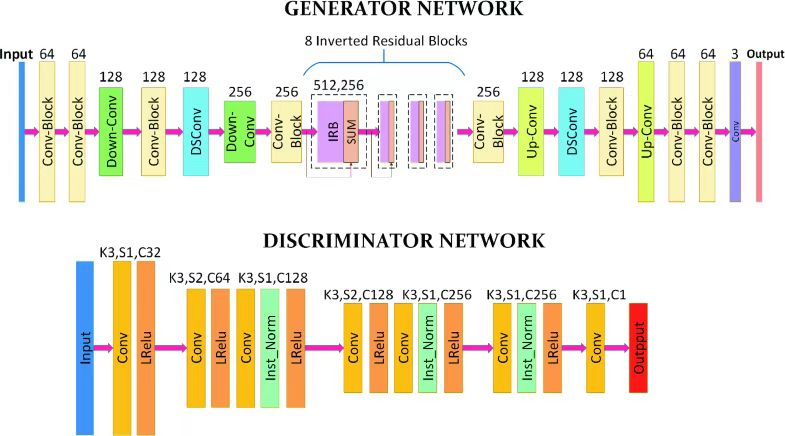

图1.AnimeGAN生成器和判别器网络结构

​		每个block结果如图2所示。

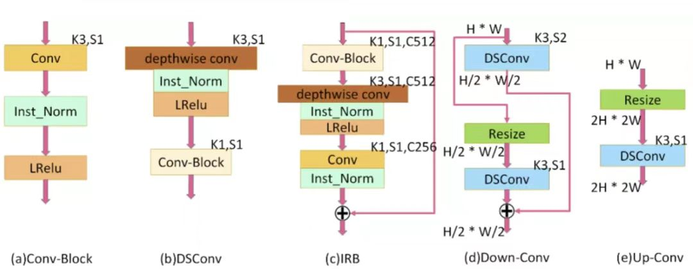

图2.AnimeGAN网络block结构图

​		AnimeGANv2使用与AnimeGAN相同的判别器，只是将实例归一化改为特征的层归一化；同时改进了生成器网络参数，使其更加轻量化，其结构如图3表示，其中K表示卷积核的大小，S表示步长，C表示卷积核的个数，IRB表示反向残差块，resize表示插值上采样方法，SUM表示逐元素相加。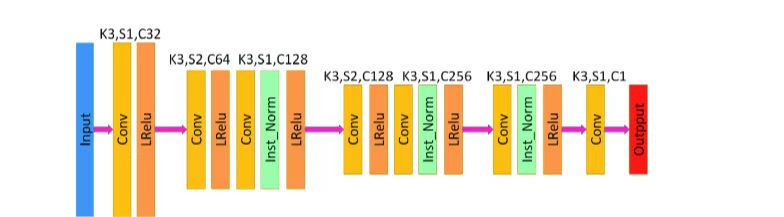

图3.AnimeGANv2生成器网络结构

#### 损失函数

##### 生成器损失

​		生成器损失函数主要分为四个部分，不同的损失有不同的权重系数，作者所采用的是 300、1.5、3、10：

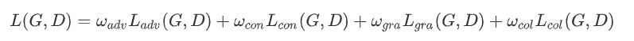

​		其中损失函数各个部分：

1. 对抗损失（adv），生成器 G 中影响动画转换过程的对抗性损失。

2. 内容损失（con），帮助生成的图像保留输入照片内容的内容丢失。

3. 灰度风格损失（gra），使生成的图像在纹理和线条上具有清晰的动漫风格。

4. 颜色重建损失（col），使生成的图像具有原照片的颜色。

​        内容丢失和灰度风格丢失，使用预先训练好的VGG19作为感知网络，提取图像的高级语义特征,损失表示为：

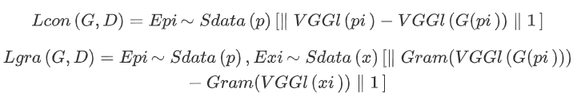

​		关于颜色的提取与转换，原文作者首先将 RGB 通道转换为 YUV 通道，然后对不同通道使用不同的损失计算方法：

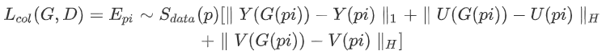

​		最终生成器损失函数表示为：

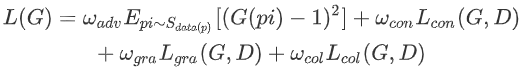

##### 判别器损失

​		AnimeGAN模型判别器损失在引入 CartoonGAN提出的促进边缘对抗损失(为了生成清晰的卡通图像边缘)外，采用一种灰度对抗损失防止生成灰度图像，最终判别器损失如下：

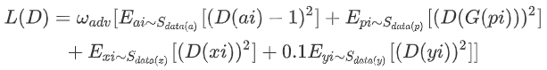

#### 数据集

​		采用了 [official dataset](https://github.com/TachibanaYoshino/AnimeGAN/releases/tag/dataset-1)数据集进行训练, 它提供了各种动漫风格，如Hayao、Paprika、Shinkai，并在“train_photo”目录中提供真实世界的图像。所有训练图片的分辨率为256x256。

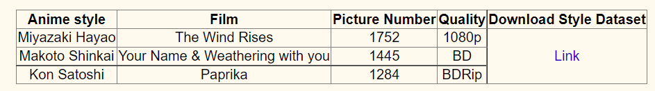

图4.AnimeGANv2训练数据信息

#### 训练模型

​		模型训练流程如图5所示。

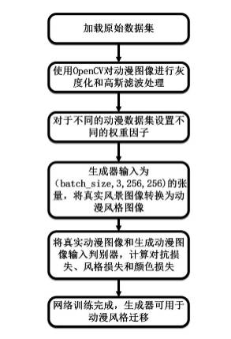

图5.AnimeGANv2训练流程

#### 动画图像生成结果

图6.AnimeGANv2生成结果

​		关于模型代码的更多详细内容可以在我们俯交的AnimeGAN2-mindspore-main文件夹中的`README`文件中查看。

## **基于向量流和灰度引导生成铅笔画风格图像**

### 原理分析

#### 观察与统计

​		真实铅笔画的具有全局和局部的特征。全局特征的统计主要集中在直方图上。对几张真实铅笔画的直方图分布进行统计和拟合，然后进行直方图匹配来转移输入图像的色调。局部特征的分析主要针对纹理。对于铅笔画来说，全局直方图分布往往与画家的个人风格密切相关，而局部特征更具有普遍性，更能反映铅笔画的特征，比全局特征更重要。

​		如图7可以看到，铅笔画的纹理由许多平行曲线组成的。对于任何一组平行曲线，组内的线都具有高度的相似性；任何两条相邻的线之间的距离，每条线的阴影、长度和宽度都非常接近。

图7.素描线条局部放大图

​		因此对这些平行线进行统计分析。为了便于统计，我们从一些现实的铅笔画中截取了一些只包含一组平行曲线的补丁，然后旋转这些补丁，直到线条的方向接近水平，如图3(a)所示。

图8.素描线条灰度值

​		图3(a)中竖直方向上红色虚线y上的像素灰度值如图3(b)所示。取(b)中的所有峰值点上画了一些红色虚线，可见任意两个相邻峰值点之间的灰度值分布曲线都接近字母V，如图3(c)所示。可知，图3(b)中的每一个“V”曲线都对应图3(a)中的一个笔画。对像素的所有列执行相同的统计。假设有n列，那么每个笔画对应n个“V”。对于某一笔画对应的n个“V”，可以假设相同位置像素点(图3(c)中的黄色点)的灰度值是独立的、同分布的。这样，就可以计算出每个“V”中每个像素的灰度值的均值和方差。

​		我们使用以下方法进行拟合。我们定义了两个变量来确定“V”曲线:宽度W和中心像素灰度值的平均值G。如图3(c)所示，W表示“V”曲线的像素量。红点表示“V”曲线的中心像素。G为中心像素灰度值的平均值。假设这条曲线上的一个像素距离红色中心像素有d个像素，则该像素灰度值的均值和方差可由下式计算:

​		现假设直线的长度为L，那么这些直线可以用W行L列的灰度值矩阵表示。对于某一行中的像素，其灰度值可以认为是独立的、同高斯分布的。现在我们定义一个形状为(W, 2)的矩阵F来记录一条直线的灰度值分布。F中的元素(w, 1)和(w, 2)表示该行中w行所有像素的灰度值的均值和方差。只要指定G和W，就可以计算出直线的分布矩阵F。

#### 笔画生成

​		首先模拟一条直线，然后在垂直方向上弯曲它，以获得更自然的效果。要画一条直线，需要指定:中心像素的灰度值mean G，线宽W，线长l。首先用G和W计算这条直线的分布矩阵F。然后对每一行，根据f随机生成每个像素的灰度值，如图4(a)所示，我们画了一些宽度W = 7像素但g不同的直线，这些直线看起来太死板了，所以我们进一步调整了它们的形状。

图9.素描线条生成

​		通过观察现实的铅笔画笔画，如图4(d)所示，我们发现笔画的头部/尾部比中间部分更细更轻，这是因为当铅笔头刚刚接触纸张表面或即将离开时，铅笔头对纸张表面的压力小于画线的中间部分时。线条并不完全是直的，而是略微弯曲的。

​		我们将之前生成的直线弯曲两次以达到这些效果。第一次弯曲，如图3(d)所示，x轴上的黄色圆点表示该线某一行的像素点。这些像素将被移到蓝色圆圈。以直线的中点为原点建立坐标系，直线上横坐标不同的像素点在Y方向上的偏差程度不同。假设蓝色圆半径为R，横坐标为x的像素将在Y方向上移动δy(x)个像素。半径R和偏移量δy(x)可计算为R = L2 4W， δy(x) = x2 2R。由于δy(x)通常是一个小数，我们在Y方向上执行线性插值来实现这个操作。弯曲后，部分像素会超过W行L列的矩阵。对于矩阵中的这些像素，我们直接丢弃它们。对于矩阵的空白部分，我们用纯白色像素填充它。现在我们有了如图4(b)所示的曲线。第一次弯曲操作的目的是使线条的头部和尾部锋利，第二次弯曲几乎与第一次相同，但我们保留了矩阵中的这些像素。第二次弯曲的目的是进一步增加曲率。现在我们有了如图4(c)所示的曲线。值得注意的是，这些曲线本质上仍然是直线，只是看起来比直线更自然。我们把笔画建模成这样的直线，而不是任意形状的曲线，一方面是因为真正的铅笔笔画大多是这样的，另一方面直线也方便我们后续的工作。

#### 算法分析：

![Figure 5: Schematic illustration of our algorithm. I is the input. ETF is the visualization of edge tangent flow vector field (Kang, Lee, and Chui 2007). {α1, α2, . . . , αn} are the area divisions of the input according to the direction of ETF vectors. Q is the quantization result of I. {β1, β2, . . . , βn} are the stroke drawing results of each area. A is the aggregation of {β1, β2, . . . , βn}. G is the gradient map of I. T is the edge map generated by G. R is the final result obtained by multiplying A and T.](https://pdf.cdn.readpaper.com/parsed/fetch_target/38aeb93278c83dd5d22946e19ae4012d_3_Figure_5_906581418.png)

图8.流程图

​		输入是我们通过对抗网络生成的动画图像；ETF是边缘切线流向量场的可视化(Kang, Lee, and Chui 2007)<a href="#ref1">[2]</a>。{α1， α2，…， αn}为输入按ETF向量方向划分的面积；Q为i的量化结果{β1， β2，…， βn}为各区域的描边结果。A是{β1， β2，…,βn}；G是i的梯度图，T是G生成的边缘图。最终由A和T相乘得到的结果铅笔画风格的图像R。

### 图片生成过程

#### (1)Grayscale Guidance(灰度引导)

​		首先调整输入灰度图像的直方图，改善其色调hue；使用CLAHE加强输入图像的对比度。

​		然后对输入图像的灰度量化为${G_1,G_2,…,G_n}$，由此步骤新生成的图像记为$Q$。

​		按行扫描Q，每一行中具有小于等于灰度级G的灰度的像素被视为一个区间，这一区间的开始像素就是未来笔触的开始位置，灰度级G即为这一笔触的central pixel gray value mean；这样就可以把水平方向的笔触画出来了（笔触的宽度W是提前确定的可调节参数）

​		利用这种方法，可以通过旋转Q来画出各个方向的笔触

#### (2)Direction Guidance(方向引导)

​		观察真实素描画可以看出，笔触的方向通常是沿着边缘的切线的，使用输入图像的梯度信息来做这个笔触方向的预测，因为梯度与边缘通常是紧密联系的；然后使用ETF（edge tangent flow）来逐像素地估计笔触的方向。构造ETF的方法：

1. 计算每个像素的梯度向量的模和方向
2. 将这些向量逆时针旋转90°
3. 迭代地调整这些向量的方向，主要目的是让模长较小的向量的方向能够趋向模长较大的向量，即起到一个类似平滑的效果

​		这样，各向量的方向就近似地与边缘平行了，我们得到了一个这些向量构成的分辨率与原图像相同的向量场。

接下来，将输入图像根据ETF划分为一定的区域。流程：

1. 将向量的方向从0到2pi量化到n个值，相位差为pi的两个向量被认为具有同一方向
2. 将具有同一方向的向量对应的像素划分到一个区域

​		分别在每个区域中绘制这一区域对应方向的笔触，就可以得到n个绘制结果，表示为${\beta_1, \beta_2, …, \beta_n}$。下一步就要将它们合并，得到整体的结果。

#### (3)Area Merging and Detail Enhancement(区域合并和细节增强)

​		按笔触方向划分区域并分别进行绘制，会导致分区之间在相加后不能很好地融合到一起，且细小的分区中笔触也会很短小，整体看去就像噪声一样。为了解决这个问题，原论文<a href="#ref1">[1]</a>的作者将笔触的首尾延长2W个像素，W为笔触的宽度。

​		从分区结果得到最终结果的表达式为：

#### (4)Process Reconstruction(过程重建)

​		为了生成更真实的绘画过程，论文<a href="#ref1">[1]</a>将每一个笔触按$S$排序，$S$是作者设计的能够近似地表明笔触多大程度上是细节或轮廓的描绘的参数。实际实现中，作者用`importance`作为变量名。在生成绘制过程之前，先将所有笔触按$S$从大到小排序，然后按顺序将它们绘制到画布上即可。

### 实验效果

​		我们将一张真实图片用AnimeGANv2模型转换为动画，再将动画图输入到铅笔画生成模型中生成素描图和彩笔图，结果如下：

| 原图                          | 动画                        | 素描图                      | 彩绘图                             |
| ----------------------------- | --------------------------- | --------------------------- | ---------------------------------- |
| 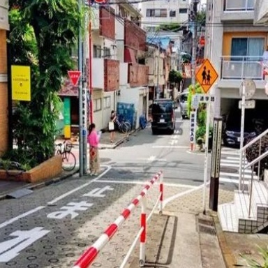 | 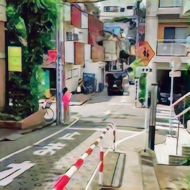 | 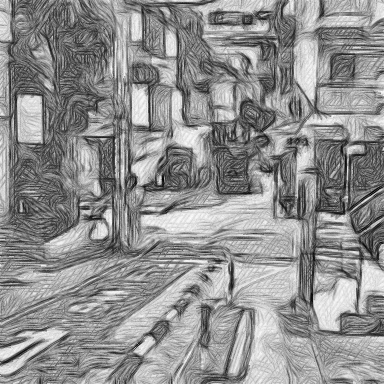 | 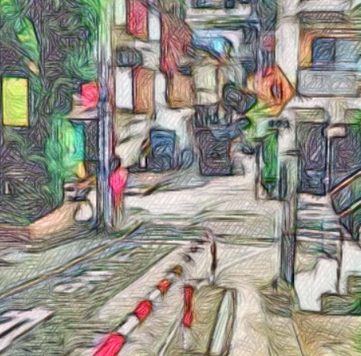 |

​		并且生成铅笔画的模型会在输出结构中创建一个process文件夹，将图像绘制过程保存在文件夹中：

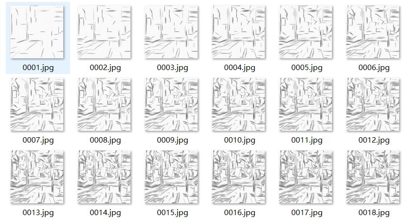

​		截取了一段时间内的绘制动图如下：

​		更多关于草图绘制模型代码的详细内容可以在我们附交在Sketch-Generation-with-Drawing-Process-Guided-by-Vector-Flow-and-Grayscale-main文件中的`README`文档中查看。

## 结果评价

​		我们用IS与FID两种指标对AnimeGANv2生成的图片进行评价：

### IS(Inception Score)评分

​		IS基于谷歌的Inception Net-V3，输入是图像，输出是1000维的向量，输出响亮的每个维度，代表着对应的属于某一类的概率。

​		IS用来衡量GAN网络的生成图片的质量和多样性这两个指标。定义公式如下：

1. 对于单一的生成图像，Inceptoin输出的概率分布应该尽量小，越小说明生成图像越可能属于某个类别，图像的质量越高。

2. 对于生成器生成一批图像而言，Inception输出的平均概率分布熵值应该尽量大，代表着生成器生成的多样性。

   我们生成的少量图像在IS评分如下图：

   

   ### FID(Fréchet Inception Distance)评分

​        FID分数是在IS基础上改进的，同样基于Inception Net-V3，它删除了模型原本的输出层，于是输出层变成了最后一层池化层，输出是2048维向量，因此每个图像都被预测为2048个特征。

​		FID是计算真实图像和生成图像的特征向量之间距离的一种度量。

​		假如一个随机变量服从高斯分布，这个分布可以用一个均值和方差来确定。那么两个分布只要均值和方差相同，则两个分布相同。我们就利用这个均值和方差来计算这两个单变量高斯分布之间的距离。但我们这里是多维的分布，我们知道协方差矩阵可以用来衡量两个维度之间的相关性。所以，我们使用均值和协方差矩阵来计算两个分布之间的距离。

​		FID越小代表着生成分布和真实图片之间越接近。

​		我们生成的少量动画图像与数据集图进行fid评分结果如下：

## 总结

 		我们使用mindspore框架复现了两篇论文的模型，成功实现了真实图像的两种风格迁移。

### 参考文献：

[1]Zhengyan Tong, Xuanhong Chen, Bingbing Ni, & Xiaohang Wang (2020). Sketch Generation with Drawing Process Guided by Vector Flow and Grayscale arXiv: Computer Vision and Pattern Recognition.reference1

[2]Kang, H.; Lee, S.; and Chui, C. K. 2007. Coherent line drawing. In Proceedings of the 5th international symposium on Non-photorealistic animation and rendering, 43–50.

[3]Jie Chen, Gang Liu, Xin Chen["AnimeGAN: A Novel Lightweight GAN for Photo Animation."](https://link.springer.com/chapter/10.1007/978-981-15-5577-0_18)
*ISICA 2019: Artificial Intelligence Algorithms and Applications pp 242-256*, 2019.

[4]animegan2-pytorch (https://github.com/bryandlee/animegan2-pytorch)

[5]animegan2 (https://github.com/TachibanaYoshino/AnimeGANv2)